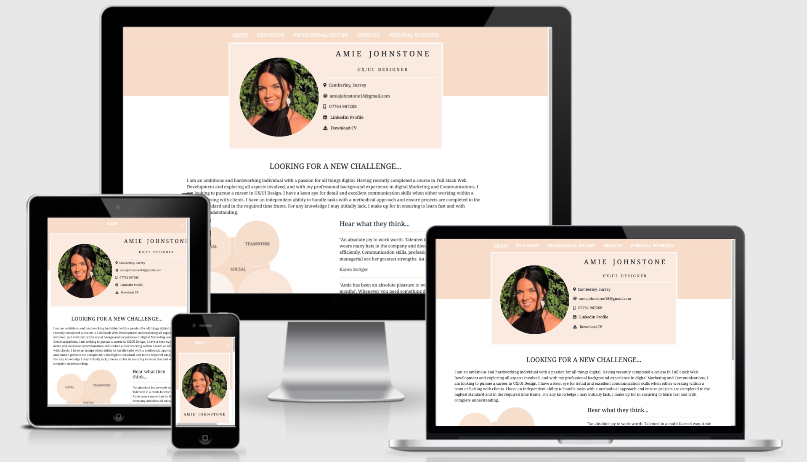
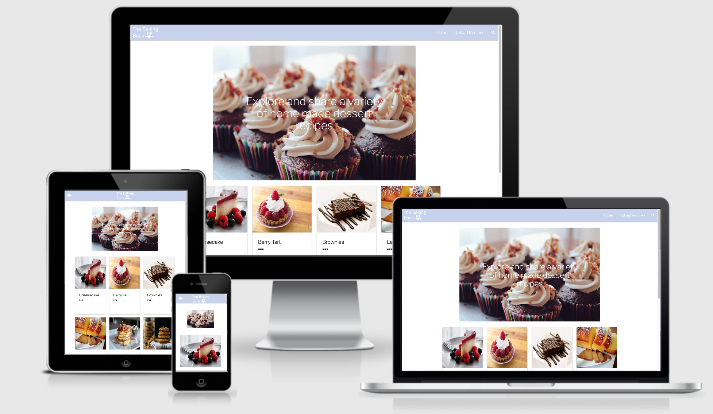

# Personal Introduction

I am an ambitious and hardworking individual with a passion for all things digital. Having recently completed a course in Full Stack Web Development and exploring all aspects involved, and with my professional background experience in digital Marketing and Communications, I am looking to pursue a career in UX/UI Design. I have a keen eye for detail and excellent communication skills when either working within a team or liaising with clients. I have an independent ability to handle tasks with a methodical approach and ensure projects are completed to the highest standard and in the required time frame. For any knowledge I may initially lack, I make up for in ensuring to learn fast and with complete understanding.

# Education

### Code Institute - 2020 - 2021
Diploma in Software Development

2:1 - Second Class Honours

After graduating University, I started Digital Marketing roles working closely with external Web 
Developers and took great interest in the different coding languages, along with the initial process from UX/UI design to website production. Realising this was a keen interest of mine, I enrolled into a Full Stack Web Development Diploma course at [Code Institute](https://codeinstitute.net).  They are the UK's only credit- rated coding bootcamp, credited by University of the West of Scotland (USW). The course took a year to complete and enabled me to develop skills in main coding languages HMTL, CSS, JavaScript, Python and Django. 

Along with main coding languages, the course also expanded on frameworks such as Bootstrap and Materialize, Application Program Interfaces (API's), jQuery, database programs such as MongoDB 
Atlas and relational database MySQL, deployment through GitHub pages (switching to PostgreSQL where applicable) and Heroku, Stripe payment system and Amazon Web Services. 

I completed four milestone projects with Code Institute which were all built through GitHub using 
Gitpod. I used version control through Git to modify the repositories to produce a step by step log
during development. Before starting the milestone development, I started with UX design by mapping out the 5 planes method of user experience and essentially created a business plan of customer and company objectives and requirements. I created wireframes for each project through using either 
Adobe Creative Suit programs or Balsamiq which assisted in the website development structure. 

Modules studied in this course:
* HTML Fundamentals
* CSS Fundamentals
* User-Centric Frontend Development
* JavaScript Fundamentals
* Interactive Frontend Development

[GitHub profile](https://github.com/Amiejohnstone18)

------

### Canterbury Christ Church University - 2014 - 2017 
Bachelor of Arts in Media and Communications 

2:1 - Second Class Honours 

First Year Modules:
* Research Skills
* Contemporary Media Debates
* Making Media, Meaning & Messages
* Media Consumption
* Introduction to Professional Communications
* Digital Media Practice

Second Year Modules:
* Popular Genres
* Media & Creative Industries
* Celebrity, News & The Media
* Writing for Media Communications
* Media & Society
* Creative Media & Communications Practice

Third Year Modules:
* Individual Research Project (Dissertation)
* Advertising Practices
* Youth Cultures
* Media Features
* Multi-Media Practice

Experienced in:
* InDesign
* Photoshop
* Illustrator
* Premiere Pro / After Effects

------

### Collingwood College Sixth Form - 2012 - 2014

3 A*- C A-Levels
* Media
* Communications & Culture
* Drama

------

### Collingwood College Sixth Form - 2007 - 2012

5+ A* - C GCSE's
 * Including Maths and English

# Professional History 

### The Glass Office People, Berkshire - April 2019 - Present
Marketing Communications Manager

* Defining and managing the brand- ensuring any external material is subject to company brand guidelines. 
* Management of all social media platforms Instagram, Twitter, Facebook, and LinkedIn, including paid social media marketing campaigns. 
* Manage Trustpilot Business and monitor reviews. 
* Produce Email Marketing -whilst also keeping track of GDPR regulations and updating a client database accordingly. 
* Management of all external marketing and advertising communications, e.g. Online magazine editorials, radio advertisement, banner advertising, traditional print marketing.
* Worked alongside external Web Developers to implement any changes required on the website, along with using the Customer Management System (CMS) to update and produce new pages when necessary.
* Managed the relationship and budget with the external Google advertising agency, particularly focusing on Pay Per Click (PPC) and remarketing. 
* Design of any marketing or advertising material/ campaigns.
* Working with a marketing budget and evolving on strategies to produce traffic results. 
* Produce monthly reports with Google analytics, comparing all paid advertising channels. 
* Keep up to date with alike companies to ensure we are offering a competitive product.
* Pay attention to latest trends and styles to incorporate where possible. 
* Design and produce all marketing and promotional materials.

------

### Panarc Interior Solutions, Berkshire - April 2019 - Present
Marketing Communications Manager

Panarc interior solutions is the sister company of The Glass Office People. I had initially joined on a temp basis as an Accounts Assistant after coming back from Australia. With both companies wanting to advance on their  marketing and advertising, I stayed to develop on these, therefore, roles and responsibilities for both are the same. 

 Accounts Assistant - March 2019 - Present

* Process incoming invoices and credit notes from suppliers into the integrity system Evolution M (Mardak).
* Checking supplier statements are up  to date with invoices and payments.
* Manage employee credit card statements.
* Process fortnightly Subcontractor invoices to be raised for payment and send out payment certificate receipts to the Subcontractors.
* Manage company vehicles.
* Book out and keep track of employee holidays.
* Arrange for employee training as and when necessary.
* Create new job contracts on Mardak with the relevant information.
* Archive expired job contracts/ account admin.
* Handle purchasing of office equipment.
* Create purchase orders for ordering site materials.

------

### Sanctuary Recruitment, Sydney, Australia - June 2018 - March 2019
Office Communications Manager (6- Month Contract)

------

### IT Talent, Reading - October 2017 - April 2018
Communications Manager (6- Month Contract)  

------

### Kurt Geiger, Canterbury - January 2015 - July 2017 
Sales Assistant - Part time (Student Study)

------

### Next, Camberley - July 2013 - July 2014
Sales Assistant - Part time (Student Study) 

------

:white_check_mark: References are available upon request. 

# Projects 

All projects were completed during the Code Institute course as Module Exams.  Wireframes for each can be found in the Respository and README . md files.

### Milestone 1 - [HIIT Fitness](https://amiejohnstone18.github.io/HIIT_Fitness/index.html)

[Repository and README.md](https://github.com/Amiejohnstone18/HIIT_Fitness)

Built using main technologies HTML5 and CSS. The requirements for this project was to build a static website advertising a service or product for a company. I chose to build a gym website offering information on the class timetable, meet the PT team, where to sign up and how to contact the gym.

### Milestone 2 - [Happy Hour](https://amiejohnstone18.github.io/Happy-Hour/index.html)

[Repository and README.md](https://github.com/Amiejohnstone18/Happy-Hour)

Happy Hour was built using main technologies HTML5, CSS and JavaScript. The purpose for this project was to build a website, incorporating an API. After much research, I found a cocktail API and decide to create a website whereby a user can select a cocktail and be provided with its name, ingredients, rating, and an image.

### Milestone 3 - [The Baking Book](https://the-baking-book.herokuapp.com/index)

[Repository and README.md](https://github.com/Amiejohnstone18/The_Baking_Book)

The Baking Book was built using main technologies HTML5, CSS, JavaScript, and Python. The 
requirements for this project was to use CRUD functionality (Create, Read, Update, Delete) to give the user the ability to create a new receipt card, read it, update it and also delete it. It is accessible for anyone to use CRUD on the website therefore recipe cards do regularly get deleted.

### Milestone 4 - [Willow Flowers](https://willow-flowers.herokuapp.com/)

[Repository and README.md](https://github.com/Amiejohnstone18/willow_flowers)

Willow Flowers was the 4th and final milestone project. This was built using main technologies HTML5, CSS, JavaScript, Python and Django. The purpose of this project was to ensure users were able to sign up and login to personal accounts and access their saved data and purchase products. Also, the website owner was able to use CRUD to update the website with products when necessary.

# Personal Interests

:art: Art & Design

:airplane: Travel

:doughnut: Food

:cherry_blossom: Nature

:leopard: Animals 

:bicyclist: Fitness 

------
A PDF version of my CV can be downloaded [here](documents/cv/cv-document.pdf).
